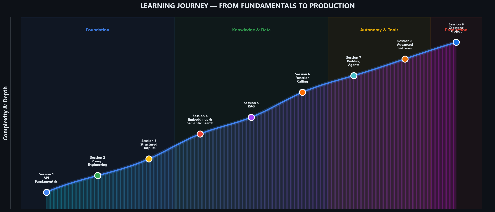
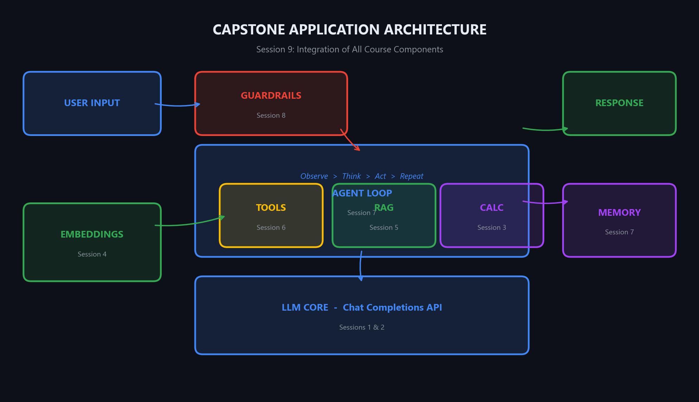
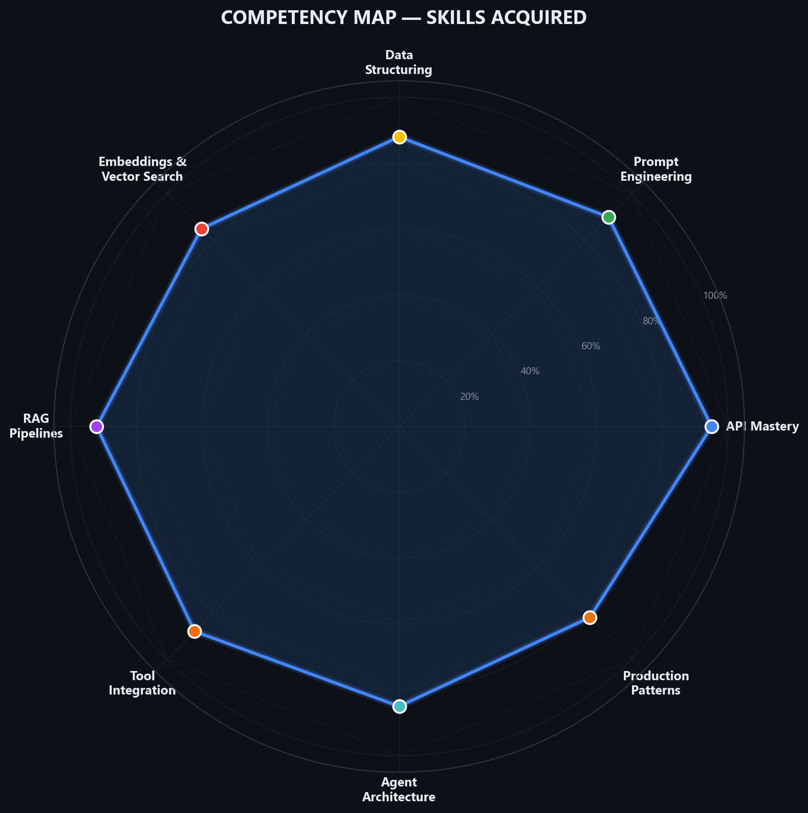
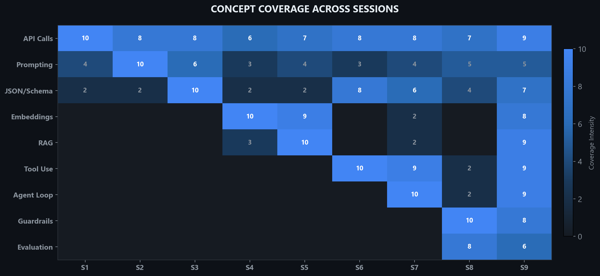
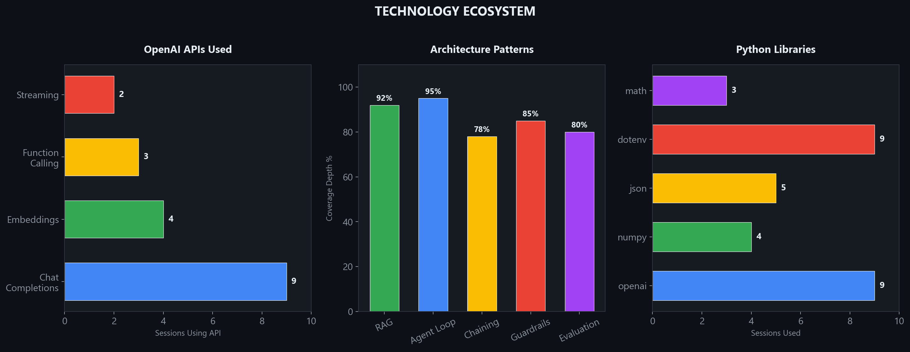

<p align="center">
  
  
  
  
  
  
</p>

<h1 align="center">Practical Large Language Models</h1>
<h3 align="center">From API Fundamentals to Production-Grade Agents</h3>

<p align="center">
  <strong>SARIAU  — Spring 2026 Semester</strong><br/>
  <em>A 9-session, hands-on graduate course designed and taught by Mohammad Asadolahi and AI :)</em><br/>
</p>

<p align="center">
  <a href="#-course-overview">Overview</a> •
  <a href="#-learning-journey">Journey</a> •
  <a href="#-session-breakdown">Sessions</a> •
  <a href="#-architecture">Architecture</a> •
  <a href="#-skills-acquired">Skills</a> •
  <a href="#-getting-started">Setup</a> •
  <a href="#-technology-ecosystem">Tech Stack</a>
</p>

---

## 📌 Course Overview

This course distills years of experience building and deploying LLM systems at scale — from the models powering Google Search to the agent architectures behind Gemini — into a focused, practical curriculum for the next generation of AI engineers.

Every session is **40 minutes of pure hands-on coding**. No slides. No lectures. Students write production-quality code from the first minute, progressively building toward a fully integrated AI assistant that combines retrieval-augmented generation, autonomous tool use, and real-time safety guardrails.

> **Philosophy:** *"The best way to understand large language models is to build with them. Theory follows intuition, and intuition comes from code."*

### What Makes This Course Different

| | Traditional AI Course | This Course |
|---|---|---|
| **Format** | Lectures + theory | 100% hands-on Jupyter notebooks |
| **Scope** | Broad ML overview | Deep-dive into LLM application engineering |
| **Output** | Academic papers | Production-ready systems |
| **Progression** | Linear topics | Cumulative — each session builds on the last |
| **Capstone** | Theoretical proposal | Working AI assistant with RAG + Agents + Guardrails |

---

## 🗺️ Learning Journey

The course follows a carefully designed progression arc — from foundational API literacy through knowledge systems, autonomous agents, and production hardening — culminating in a capstone that integrates every concept.

<p align="center">
  
</p>

### Four Phases of Mastery

```
┌─────────────────────────────────────────────────────────────────────────────┐
│                                                                             │
│   FOUNDATION          KNOWLEDGE & DATA       AUTONOMY & TOOLS   PRODUCTION  │
│   Sessions 1-3        Sessions 4-5           Sessions 6-7       Sessions 8-9│
│                                                                             │
│   ▸ API Mastery       ▸ Embeddings           ▸ Function Calling ▸ Guardrails│
│   ▸ Prompt Eng.       ▸ Semantic Search      ▸ Agent Loop       ▸ Eval      │
│   ▸ Structured I/O    ▸ RAG Pipelines        ▸ Memory           ▸ Capstone  │
│                                                                             │
└─────────────────────────────────────────────────────────────────────────────┘
```

---

## 📚 Session Breakdown

### Session 1 — LLM API Fundamentals
**`session_1_llm_api_fundamentals.ipynb`**

> Set up the OpenAI Python client and master the Chat Completions API.

- Install & configure the `openai` SDK with environment-based secrets
- Understand the three message roles: `system`, `user`, `assistant`
- Tune generation with `temperature`, `max_tokens`, and `top_p`
- Implement real-time streaming responses
- Build a reusable `chat()` helper function

**Exercise:** Build a multi-language translator with configurable formality levels.

---

### Session 2 — Prompt Engineering in Practice
**`session_2_prompt_engineering.ipynb`**

> Master the art and science of getting exactly what you want from an LLM.

- **Zero-shot** — Direct task execution without examples
- **Few-shot** — Teaching by demonstration with curated exemplars
- **Chain-of-Thought (CoT)** — Unlocking multi-step reasoning with "think step by step"
- System prompt design patterns: role assignment, constraints, format specs
- Reusable prompt templates with Python f-strings

**Exercise:** Compare zero-shot vs. few-shot vs. CoT on product review sentiment analysis.

---

### Session 3 — Structured Outputs & Output Parsing
**`session_3_structured_outputs.ipynb`**

> Extract reliable, machine-readable data from LLMs — the foundation of every production pipeline.

- JSON mode with `response_format: json_object`
- Strict schemas via `json_schema` for guaranteed field types and enums
- Robust parsing with validation and graceful error handling
- Batch processing pipelines for structured extraction at scale

**Exercise:** Build a resume/CV information extractor that outputs validated JSON.

---

### Session 4 — Text Embeddings & Semantic Search
**`session_4_embeddings_semantic_search.ipynb`**

> Transform text into mathematical meaning — then search by *concept*, not keyword.

- Generate 1536-dimensional embeddings with `text-embedding-3-small`
- Implement cosine similarity: $\cos(\theta) = \frac{\mathbf{A} \cdot \mathbf{B}}{\|\mathbf{A}\| \|\mathbf{B}\|}$
- Build a semantic search engine from scratch with NumPy
- Demonstrate superiority over keyword matching on ambiguous queries

**Exercise:** Build a FAQ knowledge base with semantic query understanding.

---

### Session 5 — Retrieval-Augmented Generation (RAG)
**`session_5_rag.ipynb`**

> Give your LLM a brain — answer questions grounded in your own documents.

- End-to-end RAG architecture: **Chunk → Embed → Index → Retrieve → Generate**
- Smart document chunking with overlap for context continuity
- `SimpleRAG` class with `add_document()`, `retrieve()`, and `ask()` methods
- Boundary testing: verify the model says "I don't know" for out-of-scope queries
- Multi-document scaling and knowledge base expansion

**Exercise:** Build a Q&A chatbot over a custom document collection.

---

### Session 6 — Function Calling & Tool Use
**`session_6_function_calling.ipynb`**

> Teach LLMs to reach beyond text — call APIs, query databases, execute code.

- The function calling flow: **User → LLM → Tool Call → Execute → Result → LLM → Answer**
- Define tool schemas with JSON parameter specs
- Handle single and parallel tool calls in one response
- Implement calculator, weather, and datetime tools
- Seamless tool registration and dispatch architecture

**Exercise:** Build a product search assistant with a custom `search_products` tool.

---

### Session 7 — Building LLM Agents
**`session_7_building_agents.ipynb`**

> From tool use to autonomy — build agents that reason, plan, and act in a loop.

- The **ReAct** pattern: **Observe → Think → Act → Repeat**
- Implement an autonomous agent loop with max-iteration safeguards
- Tools: calculator, knowledge base search, currency exchange rates
- `ConversationalAgent` class with persistent conversation memory
- Multi-step reasoning across chained tool calls

**Exercise:** Solve complex multi-step queries (density calculations, cross-country comparisons, per-capita analysis).

---

### Session 8 — Advanced Patterns & Best Practices
**`session_8_advanced_patterns.ipynb`**

> Production-harden your LLM applications with patterns used at Google-scale.

- **LLM Chaining** — Multi-step pipelines: summarize → extract entities → generate briefing
- **Input Guardrails** — Prompt injection detection, off-topic filtering, content moderation
- **Cost Management** — Token counting, usage tracking, cost estimation per request
- **LLM-as-a-Judge** — Automated output evaluation with criteria-based scoring
- **Retry with Fallback** — Exponential backoff for API resilience

**Exercise:** Build a fully moderated content pipeline: Safety Check → Generate → Evaluate.

---

### Session 9 — Capstone: Full LLM Application
**`session_9_capstone.ipynb`**

> The grand integration — every concept from every session, unified into one system.

- **`SmartAssistant`** class combining RAG + Function Calling + Agent Loop + Guardrails + Memory
- 10-document knowledge base (TechNova company data: products, pricing, revenue, competitors)
- Three integrated tools: knowledge search, calculator, competitor analysis
- Input safety pipeline with real-time moderation
- Interactive conversational loop with session memory
- Six progressive demo scenarios testing every capability

**Exercise:** Extend the assistant with a new tool or additional knowledge source.

---

## 🏗️ Architecture

The capstone application demonstrates how every session's concepts compose into a production-grade system:

<p align="center">
  
</p>

```
User Query
  │
  ▼
┌──────────────────┐
│   GUARDRAILS     │  ◄── Session 8: Injection detection, content moderation
│   Safety Check   │
└────────┬─────────┘
         ▼
┌──────────────────────────────────────────┐
│             AGENT LOOP                   │ ◄── Session 7: ReAct reasoning
│                                          │
│  ┌─────────┐ ┌─────────┐ ┌────────────┐  │
│  │  RAG    │ │  TOOLS  │ │ CALCULATOR │  │ ◄── Sessions 5, 6, 3
│  │ Search  │ │  Call   │ │  Evaluate  │  │
│  └────┬────┘ └────┬────┘ └─────┬──────┘  │
│       └───────────┼────────────┘         │
│                   ▼                      │
│         ┌─────────────────┐              │
│         │ EMBEDDINGS      │              │ ◄── Session 4: Semantic matching
│         │ Cosine Sim.     │              │
│         └─────────────────┘              │
└──────────────────┬───────────────────────┘
                   ▼
         ┌──────────────────┐
         │   LLM CORE       │ ◄── Sessions 1-2: Chat Completions + Prompting
         │ Chat Completions │
         └────────┬─────────┘
                  ▼
            ┌──────────┐
            │ RESPONSE │ + Conversation Memory (Session 7)
            └──────────┘
```

---

## 🎯 Skills Acquired

Upon completing this course, students achieve proficiency across eight core competency dimensions of modern LLM application engineering:

<p align="center">
  
</p>

---

## 📊 Concept Coverage Matrix

Every concept is introduced, reinforced, and integrated across multiple sessions — ensuring deep retention through progressive layering:

<p align="center">
  
</p>

---

## ⚙️ Technology Ecosystem

<p align="center">
  
</p>

### Core Stack

| Layer | Technology | Purpose |
|-------|-----------|---------|
| **LLM API** | OpenAI Chat Completions | Text generation, reasoning, tool dispatch |
| **Embeddings** | `text-embedding-3-small` | 1536-dim semantic vectors |
| **Runtime** | Python 3.11+ | Notebook execution environment |
| **Vectorization** | NumPy | Cosine similarity, vector ops |
| **Data** | JSON / `json` module | Structured I/O, tool schemas |
| **Config** | `python-dotenv` | Secure API key management |

---

## 🚀 Getting Started

### Prerequisites

- Python 3.11 or later
- An OpenAI API key (or compatible endpoint)
- Jupyter Notebook / JupyterLab / VS Code with Jupyter extension

### Installation

```bash
# Clone the repository
git clone https://github.com/your-org/sariau-llm-course-spring-2026.git
cd sariau-llm-course-spring-2026

# Install dependencies
pip install openai numpy python-dotenv

# Configure your API key
cp .env.example .env
# Edit .env and add your OPENAI_API_KEY
```

### Environment Configuration

Create a `.env` file in the project root:

```env
OPENAI_API_KEY=your-api-key-here
MODEL_NAME=gpt-4o-mini
```

### Running the Notebooks

```bash
# Launch Jupyter
jupyter notebook

# Or use VS Code
code .
# Open any session_*.ipynb file
```

> **Tip:** Work through the sessions sequentially. Each notebook builds on concepts from previous sessions, and the capstone (Session 9) integrates everything.

---

## 📂 Repository Structure

```
.
├── README.md                                  # This file
├── curriculum.md                              # Full curriculum outline
├── session_1_llm_api_fundamentals.ipynb       # API setup & Chat Completions
├── session_2_prompt_engineering.ipynb          # Zero/few-shot, CoT, system prompts
├── session_3_structured_outputs.ipynb         # JSON mode & schema validation
├── session_4_embeddings_semantic_search.ipynb  # Embeddings & semantic search
├── session_5_rag.ipynb                        # Retrieval-Augmented Generation
├── session_6_function_calling.ipynb           # Tool use & function calling
├── session_7_building_agents.ipynb            # Autonomous agent construction
├── session_8_advanced_patterns.ipynb          # Production patterns & guardrails
├── session_9_capstone.ipynb                   # Full application integration
└── assets/                                    # Generated course visualizations
    ├── learning_journey.png
    ├── skills_radar.png
    ├── tech_stack.png
    ├── architecture.png
    └── heatmap.png
```

---

## 🎓 Course Summary

| Session | Topic | Key Deliverable |
|:-------:|-------|----------------|
| **1** | API Fundamentals | Multi-language translator |
| **2** | Prompt Engineering | Strategy-comparative sentiment analyzer |
| **3** | Structured Outputs | Resume information extractor |
| **4** | Embeddings & Search | Semantic FAQ search engine |
| **5** | RAG | Document Q&A chatbot |
| **6** | Function Calling | Multi-tool assistant |
| **7** | Building Agents | Autonomous research agent |
| **8** | Advanced Patterns | Moderated content pipeline |
| **9** | Capstone | Full Smart Research Assistant |

---

## 🔮 Where to Go Next

After completing this course, students are equipped to explore:

- **Production Deployment** — FastAPI/Flask serving, Docker containerization, cloud deployment
- **LLM Frameworks** — LangChain, LlamaIndex, Semantic Kernel for rapid prototyping
- **Fine-Tuning** — Domain-specific model adaptation with custom datasets
- **Multimodal AI** — Vision, audio, and video understanding with GPT-4o and Gemini
- **Advanced Evaluation** — RAGAS, DeepEval, and systematic benchmark suites
- **Enterprise Patterns** — Multi-agent orchestration, human-in-the-loop, compliance pipelines

---

<p align="center">
  <br/>
  <strong>Designed & Taught by Mohammad Asadolahi</strong><br/>
  <em>SARIAU (SRB University) — Spring 2026</em><br/>
  <br/>
  
  
</p>
